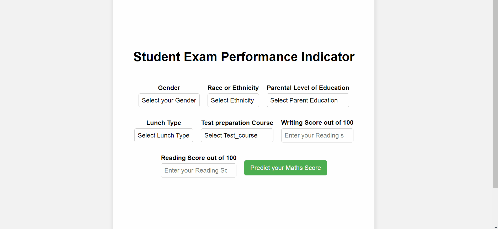

# Student Performance Indicator

### Information About the Dataset:

**The dataset** The goal of this project is to understand the influence of the parents background, test preparation, and various other variables on the students math score.

There are 8 independent variables:

- `gender` : Sex of a student (Male/Female)
- `race/ethnicity` : Ethnicity of a student (Group A,B,C,D,E)
- `parental level of education` : parents' final education (bachelor's degree,some college,master's degree,associate's degree,high school)
- `lunch` : What type of lunch the student had before test (standard or free/reduced)
- `test preparation course` : Whether the student completed any preparation course before the test.
- `reading score` : Reading score obtained by the student.
- `writing score` : Writing score obtained by the student.

Target variable:

- `math score`: Math score of a student.

Dataset Source Link :
[https://www.kaggle.com/datasets/spscientist/students-performance-in-exams?resource=download](https://www.kaggle.com/datasets/spscientist/students-performance-in-exams?resource=download)

# Animation of UI

# Project Development Approach

1. Data Ingestion :

   - In Data Ingestion phase the data is first read as csv.
   - Then the data is split into training and testing and saved as csv file.

2. Data Transformation :

   - In this phase a ColumnTransformer Pipeline is created.
   - for Numeric Variables first SimpleImputer is applied with strategy median (because there were some outliers in the data), then standard scaling is performed on numeric data.
   - for Categorical Variables SimpleImputer is applied with most frequent strategy, then one-hot-encoding is performed, after this data is scaled with standard scaler.
   - This preprocessor is saved as pkl file inside the artifacts folder.

3. Model Training :

   - In this phase, all the models are trained and evaluated. The best model found was Linear Regression.
   - After this hyperparameter tuning is also performed prior to selecting the best model.
   - This model is saved as pickle file to be used for the predict pipeline.

4. Prediction Pipeline :
   - This pipeline converts given data into dataframe and has various functions to load pickle files and predict the final results in python.

5. Flask App creation :
   - Flask app is created with User Interface to predict the math score of a student given the required features inside a Web Application.

# Exploratory Data Analysis Notebook

Link : [EDA Notebook](./notebook/eda_on_data.ipynb)

# Model Training Approach Notebook

Link : [Model Training Notebook](./notebook/model_training.ipynb)

# Usage:

1. conda create -p std python=3.8 -y
2. conda activate std/
3. pip install -r requirements.txt
4. Execute app.py
5. Access http://127.0.0.1:5000/
